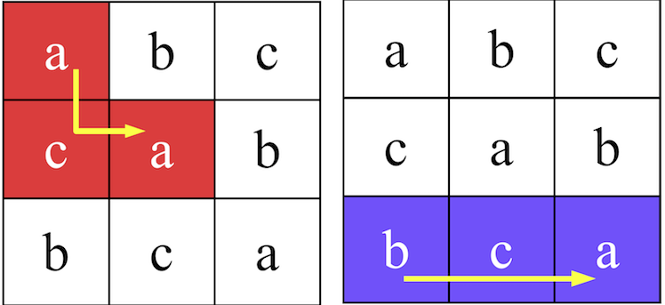

# Câu hỏi
Xác định xem chuỗi chữ cái có ở trong bản hay không?

# Đề bài
Cho 1 bảng hình vuông. Mỗi 1 ô có 1 chữ cái.

Để tạo 1 chuỗi chữ cái bạn có thể làm các thao tác sau
1. chọn 1 ô bất kỳ làm điểm xuất phát
2. từ ô đang chọn bạn có thể chọn 1 ô bất kỳ cạnh ô đang chọn theo chiều ngang, chiều dọc

ví dụ như bảng bên phải ở trên bạn có thể tạo 
ra chuỗi chữ cái là bca nhưng ko tạo được chuỗi chữ cái bcc

# 1 số sample để test
## Test data 1
### Input
#### nội dung ô vuông
3

abc

cab

bca
#### các nội dung chuỗi chữ cái xem có thể tạo ra từ bảng hay ko
3

aca

bca

bcc

### Output
yes
yes
no

## Test data 2
### Input
#### nội dung ô vuông
4

abcd

efgh

hgfe

dcba

#### các nội dung chuỗi chữ cái xem có thể tạo ra từ bảng hay ko
5

abfgf

bfgc

abfga

hdc

fghde

###  Output
yes

yes

no

yes

no
